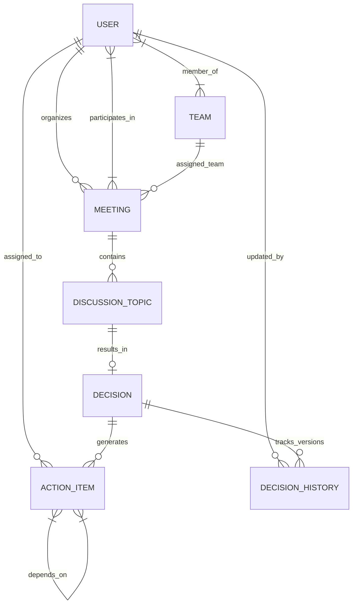

# Smart Meeting Decision Tracker (SMDT)

An enterprise web application designed to streamline the lifecycle of organizational meetings: **Meeting Setup ➔ Discussion ➔ Decision Recording ➔ Action Item Tracking ➔ Dependency Enforcement ➔ Completion & Audit**.

---

## 1. Project Overview

**Smart Meeting Decision Tracker (SMDT)** helps organizations eliminate unproductive meetings by turning discussions into trackable, actionable decisions with assigned responsibilities, due date enforcement, action item dependencies, and audit trails.

### What the Application Does:
- **User Authentication & OAuth 2.0**: Secure registration, login, 6-digit email OTP verification, password reset, and Single Sign-On (SSO) via **Google** and **GitHub**.
- **Role-Based Access Control (RBAC)**: Multi-tier authorization supporting `OWNER`, `ADMIN`, `MANAGER`, and `MEMBER` roles.
- **Meeting Management**: Schedule internal, client, project, planning, or review meetings. Supports physical conference room assignment or virtual Google Meet links (Public or Password-protected).
- **Recurring Meetings**: Automated daily, weekday, or weekly meeting series creation with auto-generated daily meeting instances for ongoing tracking.
- **Discussion Topics & Decisions**: Record meeting agenda points, assign priority levels, and document official decisions with full version history audit trails (`DecisionHistory`).
- **Action Item Tracking**: Assign action items to team members with priority, due dates, work completed notes, and **dependency locking** (prerequisite tasks must be finished before an action can be completed).
- **Overdue Monitoring & Email Alerts**: Real-time identification of overdue action items and automated transactional email notifications via Brevo API/SMTP relay.
- **Analytics & Visual Dashboards**: High-density dashboard featuring key performance indicators (KPIs), action completion rates, workload breakdown by user, and visual charts (Recharts).

---

## 2. Technology Stack

### Frontend
- **Framework / Build Engine**: React 18 SPA (powered by Vite 5)
- **Language**: JavaScript (ES6+) / React JSX
- **Routing**: React Router DOM v6 (`react-router-dom`)
- **UI Components & Icons**: Ant Design (`antd` 5.14) & `@ant-design/icons`
- **Styling**: Tailwind CSS (v3.4) + Custom CSS
- **Data Visualization**: Recharts (v2.12)
- **HTTP Client**: Axios (v1.6) with JWT token injection interceptors

### Backend
- **Language**: Python 3.10+
- **Web Framework**: Django (v4.2 LTS)
- **REST Framework**: Django REST Framework (DRF v3.14)
- **Authentication**: SimpleJWT (`djangorestframework-simplejwt` v5.3) & OAuth 2.0 (Google & GitHub)
- **Filtering & Ordering**: `django-filter` (v23.3) & custom exact phrase search
- **CORS Handling**: `django-cors-headers` (v4.3)
- **Email Gateway**: Brevo Transactional Email API / SMTP Relay with IPv4 socket fallback

### Database
- **Production**: PostgreSQL 14+ / MySQL 8+
- **Development / Local**: SQLite3 (supported for zero-config local setup)

---

## 3. Project Structure

```text
SMDT/
├── backend/                        # Django REST API Backend Application
│   ├── manage.py                   # Django management CLI utility
│   ├── requirements.txt            # Python backend dependencies
│   ├── .env.example                # Template for environment variables
│   ├── smart_meeting_tracker/      # Core Django settings & configuration
│   │   ├── settings.py             # Global settings, DB config, JWT & Brevo email setup
│   │   ├── urls.py                 # Primary API routing table
│   │   ├── middleware.py           # Custom CORS & security middleware
│   │   ├── filters.py              # Exact phrase search filter backends
│   │   └── pagination.py           # Custom DRF pagination handler
│   ├── apps/                       # Modular Django apps
│   │   ├── authentication/         # User model, OAuth 2.0, OTP password reset & email change
│   │   ├── teams/                  # Teams, departments, and member management
│   │   ├── meetings/               # Meeting scheduling, recurrence logic & OTP entry codes
│   │   ├── discussions/            # Discussion topics and priority tracking
│   │   ├── decisions/              # Decision recording & DecisionHistory version auditing
│   │   ├── actions/                # Action items, overdue calculations, & dependency blocking
│   │   ├── analytics/              # Dashboard metrics & aggregate chart data
│   │   └── notifications/          # In-app notifications & email dispatch
│   └── tests/                      # Automated Django unit test suite
│
├── frontend/                       # Vite + React 18 SPA Frontend Application
│   ├── package.json                # Node dependencies and scripts
│   ├── vite.config.js              # Vite server & build configuration
│   ├── tailwind.config.js          # Tailwind CSS theme & utility setup
│   ├── index.html                  # HTML5 entry point
│   ├── .env.local                  # Frontend environment variables
│   └── src/
│       ├── main.jsx                # React DOM root render entry point
│       ├── App.jsx                 # Main application routes & context providers
│       ├── index.css               # Global Tailwind CSS & AntD style overrides
│       ├── pages/                  # Page components
│       │   ├── Home.jsx            # Landing / public introduction page
│       │   ├── Login.jsx           # User authentication & OAuth login
│       │   ├── Register.jsx        # Account registration with OTP email verification
│       │   ├── Dashboard.jsx       # Analytics dashboard & KPI overview
│       │   ├── Meetings.jsx        # Meetings directory & monthly calendar view
│       │   ├── CreateMeeting.jsx   # Meeting scheduling form
│       │   ├── MeetingDetail.jsx   # Detailed meeting agenda, discussions, decisions & actions
│       │   ├── MyActions.jsx       # Personal action item workspace & dependency status
│       │   ├── Admin.jsx           # Team & User management portal for Admins/Owners
│       │   └── OAuthCallback.jsx   # OAuth 2.0 token processing callback
│       ├── components/             # Reusable UI components
│       │   ├── Navbar.jsx          # Top header & mobile bottom navigation bar
│       │   ├── MainLayout.jsx      # Primary layout wrapper
│       │   ├── DecisionModal.jsx   # Decision record/update modal
│       │   ├── ActionFormModal.jsx # Action item creation & edit modal
│       │   ├── EditMeetingModal.jsx# Meeting details edit modal
│       │   ├── StatusBadge.jsx     # Color-coded status & priority badges
│       │   └── ProfileModal.jsx    # User profile & security settings modal
│       ├── context/                # React State Contexts
│       │   ├── AuthContext.jsx     # Authentication state, login/logout, JWT storage
│       │   └── ThemeContext.jsx    # Dark / Light UI mode state
│       └── services/               # Axios API client modules (`api.js`)
└── README.md                       # Complete Project Documentation
```

---

## 4. Installation

### Prerequisites
- **Node.js**: v18.0.0 or higher
- **npm**: v9.0.0 or higher
- **Python**: v3.10 or higher
- **PostgreSQL / MySQL** *(Optional: defaults to SQLite3 if DB credentials are omitted)*

---

### Backend Setup

1. **Navigate to the backend folder**:
   ```bash
   cd backend
   ```

2. **Create and activate a Python virtual environment**:
   - **Windows (PowerShell)**:
     ```powershell
     python -m venv venv
     .\venv\Scripts\Activate.ps1
     ```
   - **Linux / macOS**:
     ```bash
     python3 -m venv venv
     source venv/bin/activate
     ```

3. **Install dependencies**:
   ```bash
   pip install -r requirements.txt
   ```

4. **Environment Variables Configuration**:
   Create a `.env` file in the `backend/` directory based on `.env.example`:
   ```bash
   cp .env.example .env
   ```
   *Edit `.env` to configure your secret key, database connections, and SMTP/Brevo email settings.*

5. **Run Migrations**:
   ```bash
   python manage.py migrate
   ```

6. **Create Organization OWNER / Superuser**:
   ```bash
   python manage.py create_owner --username=admin --email=admin@company.com --password=Password123!
   ```

---

### Frontend Setup

1. **Navigate to the frontend folder**:
   ```bash
   cd frontend
   ```

2. **Install Node modules**:
   ```bash
   npm install
   ```

3. **Environment Variables Configuration**:
   Create a `.env.local` file in the `frontend/` directory:
   ```env
   VITE_API_URL=http://localhost:8080/api
   VITE_GOOGLE_CLIENT_ID=your-google-client-id.apps.googleusercontent.com
   VITE_GITHUB_CLIENT_ID=your-github-client-id
   ```

---

## 5. Running the Project

### 1. Start the Backend API Server
From the `backend/` directory (with virtual environment activated):
```bash
python manage.py runserver 8080
```
- **API Base Endpoint**: `http://localhost:8080/api/`
- **Django Admin Panel**: `http://localhost:8080/admin/`

### 2. Start the Frontend Development Server
From the `frontend/` directory in a separate terminal:
```bash
npm run dev
```
- **Web Interface**: `http://localhost:3000` (or `http://localhost:5173`)

---

## 6. API Documentation

### Authentication & Account Endpoints
| Method | Endpoint | Description | Auth Required |
| :--- | :--- | :--- | :--- |
| `POST` | `/api/auth/register/` | Register user account with email OTP verification | No |
| `POST` | `/api/auth/token/` | Obtain JWT access and refresh tokens | No |
| `POST` | `/api/auth/token/refresh/` | Refresh expired JWT access token | No |
| `POST` | `/api/auth/oauth/google/` | Authenticate / Register via Google OAuth 2.0 | No |
| `POST` | `/api/auth/oauth/github/` | Authenticate / Register via GitHub OAuth 2.0 | No |
| `POST` | `/api/auth/password-reset/request-otp/` | Request 6-digit password reset OTP email | No |
| `POST` | `/api/auth/password-reset/confirm/` | Confirm password reset using OTP code | No |
| `GET/PATCH` | `/api/auth/profile/` | Fetch or update user profile details | Yes |

### Meetings Endpoints
| Method | Endpoint | Description | Auth Required |
| :--- | :--- | :--- | :--- |
| `GET` | `/api/meetings/` | List meetings (supports `?search=`, `?status=`, `?meeting_type=`) | Yes |
| `POST` | `/api/meetings/` | Schedule a new meeting (supports recurring pattern configuration) | Yes |
| `GET` | `/api/meetings/{id}/` | Retrieve detailed meeting information including discussions & decisions | Yes |
| `PUT/PATCH` | `/api/meetings/{id}/` | Update meeting details | Yes |
| `POST` | `/api/meetings/{id}/send-reminder/` | Send email reminder to all invited attendees | Yes |
| `POST` | `/api/meetings/{id}/send-otp/` | Dispatch 6-digit entry OTP for meeting check-in | Yes |

### Discussions, Decisions & Action Items Endpoints
| Method | Endpoint | Description | Auth Required |
| :--- | :--- | :--- | :--- |
| `GET/POST` | `/api/discussions/` | List or record discussion topics for a meeting | Yes |
| `POST` | `/api/decisions/` | Record a decision for a discussion topic (Version 1) | Yes |
| `PUT/PATCH` | `/api/decisions/{id}/` | Update decision text (Creates an immutable `DecisionHistory` snapshot) | Yes |
| `GET` | `/api/decisions/{id}/history/` | Fetch version audit history for a decision | Yes |
| `GET/POST` | `/api/actions/` | List or create action items (supports setting prerequisite dependencies) | Yes |
| `GET` | `/api/actions/my_actions/` | List action items assigned to the authenticated user | Yes |
| `PATCH` | `/api/actions/{id}/` | Update action status (Enforces prerequisite dependency checks) | Yes |

### Analytics & Notifications Endpoints
| Method | Endpoint | Description | Auth Required |
| :--- | :--- | :--- | :--- |
| `GET` | `/api/analytics/dashboard/` | Fetch KPI stats, completion rates, and user workload distributions | Yes |
| `GET` | `/api/notifications/` | List in-app notifications for the user | Yes |
| `POST` | `/api/notifications/{id}/read/` | Mark notification as read | Yes |

---

## 7. Database Design

### Entity Relationship Diagram (ERD)



### Entity Relationship Details:
1. **User (`User`)**: Custom user entity extended with `role` (`OWNER`, `ADMIN`, `MANAGER`, `MEMBER`), `department`, and OAuth provider identifiers.
2. **Team (`Team`)**: Represents organizational units or departments containing multiple user members.
3. **Meeting (`Meeting`)**: Stores title, description, date, start/end time, location type, Google Meet link, password, organizer (FK to `User`), assigned team (FK to `Team`), and participants (M2M to `User`).
4. **DiscussionTopic (`DiscussionTopic`)**: Belongs to a `Meeting` (FK). Captures agenda items, priority (`HIGH`, `MEDIUM`, `LOW`), and background context.
5. **Decision (`Decision`)**: One-to-One relationship with `DiscussionTopic`. Stores approved decision text, current version number, and decider (FK to `User`).
6. **DecisionHistory (`DecisionHistory`)**: Immutable versioning table storing historical snapshots of decision text, version numbers, modification timestamps, and updating user (FK to `User`).
7. **ActionItem (`ActionItem`)**: Belongs to a `Decision` (FK). Stores assigned user (FK to `User`), title, description, due date, status (`PENDING`, `IN_PROGRESS`, `COMPLETED`, `CANCELLED`), priority, completion notes, and a **Self-Referential Many-to-Many relationship** (`dependencies`) pointing to required prerequisite action items.

---

## 8. Important Business Rules

### 1. Overdue Action Item Logic
- An action item is classified as **Overdue** if:
  $$\text{due\_date} < \text{current\_date} \quad \text{AND} \quad \text{status} \neq \text{'COMPLETED'}$$
- Overdue items automatically highlight in red across dashboard KPI counters, action tables, and analytics reports.

### 2. Action Dependencies (Prerequisite Locking)
- An `ActionItem` can depend on one or more prerequisite `ActionItem` tasks.
- **Backend Validation**: When a user attempts to update an action item's status to `COMPLETED`, the backend validates that all prerequisite tasks in `dependencies.all()` have a status of `COMPLETED`.
- If any prerequisite task remains incomplete, the backend blocks the operation and returns a `400 Bad Request` with details specifying which prerequisite action items must be completed first.

### 3. Decision History & Version Auditing
- Decisions are immutable in historical record: updating an existing `Decision` does **not** overwrite past entries.
- Each modification automatically increments the decision's `version` counter by $+1$ and logs a complete snapshot in `DecisionHistory` storing the exact decision text, author, and timestamp.

### 4. Role-Based Permissions (RBAC)
- **`OWNER`**: Full organization control, user role management, system deletion rights, and access to all meetings/analytics.
- **`ADMIN`**: Management of teams and users (`MANAGER`/`MEMBER`), meeting scheduling, and organization-wide analytics. Cannot modify `OWNER` accounts.
- **`MANAGER`**: Team-level meeting creation, action item assignment, and team dashboard tracking.
- **`MEMBER`**: Access to participating meetings, capability to update personal assigned action items, and personal workspace view.

---

## 9. Testing

### Running Backend Automated Tests
From the `backend/` directory:
```bash
python manage.py test tests
```
The test suite validates:
- User registration, login, and JWT token issuance.
- OTP generation, email dispatch, and single-use verification.
- Action item dependency enforcement (verifying 400 Bad Request when prerequisites are incomplete).
- Overdue logic calculations.
- Decision version incrementing and `DecisionHistory` snapshot logging.

### Running Frontend Verification
From the `frontend/` directory:
```bash
npm run test
```
Or run a production build verification:
```bash
npm run build
```

---

## 10. Assumptions

1. **Single Primary Organization**: The system assumes an organization structure where users belong to departments and teams under a shared central workspace.
2. **UTC Timestamp Standard**: All meeting dates, time ranges, and decision audit timestamps are stored in UTC format and converted to the client's local timezone for rendering.
3. **Brevo API Email Gateway**: For production deployments, transactional email delivery relies on Brevo API / SMTP relay settings configured via environment variables.

---

## 11. Known Limitations & Future Work

1. **Calendar Provider Sync**: Meeting scheduling currently generates Google Meet links and calendar entries inside the application; direct 2-way synchronization with external Google Calendar / Outlook APIs can be expanded.
2. **File Attachments**: Discussion points and action items currently support rich text descriptions; direct document file upload attachments (PDF, DOCX) are planned for future releases.

---

© 2026 Smart Meeting Decision Tracker (SMDT). All rights reserved.
