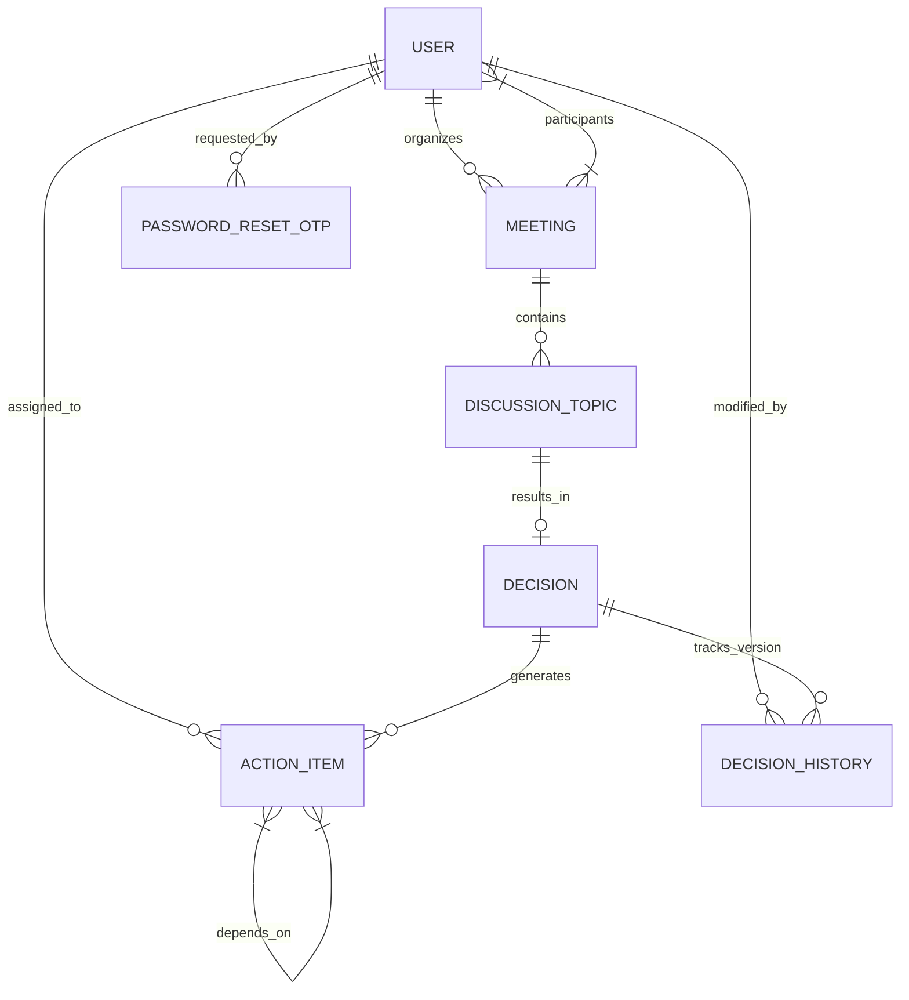

# Smart Meeting Decision Tracker (SMDT)

A comprehensive enterprise web application designed to streamline the lifecycle of organizational meetings: **Meeting Setup ➔ Discussion ➔ Decision Recording ➔ Action Item Tracking ➔ Dependency Enforcement ➔ Completion & Audit**.

---

## 1. Project Overview

**Smart Meeting Decision Tracker (SMDT)** helps organizations convert unproductive meeting discussions into actionable, trackable decisions. 

### Key Features:
- **Authentication & OAuth 2.0**: Email/Password authentication with 6-digit OTP verification, plus Single Sign-On (SSO) via **Google** and **GitHub**.
- **Brevo Executive Email Delivery System**: Enterprise-grade HTTPS REST API email delivery (`https://api.brevo.com/v3/smtp/email`) with multi-port SMTP relay fallbacks (587, 2525, 465) for OTP codes, password resets, and meeting notifications.
- **Profile Details Management**: Edit user profile details (`first_name`, `last_name`, `department`) with read-only protection on email mutation.
- **Secure OTP Email Update Flow**: 2-step verification flow where requesting an email change dispatches a 6-digit verification code directly to the **new email inbox** before updating the database.
- **Permanent Account Deletion (Danger Zone)**: Self account deletion allowing users to permanently delete their profile, credentials, and OTP records with password or OAuth confirmation.
- **Meeting Management**: Schedule, track, and search meetings by status (`UPCOMING`, `IN_PROGRESS`, `COMPLETED`), type, date, or title.
- **Discussion & Decisions**: Capture meeting discussion points and link definitive decisions with full version history and audit snapshots (`DecisionHistory`).
- **Action Item Management**: Assign tasks to users with due dates, priority levels, and **dependency locking** (an action item cannot be marked `COMPLETED` until all prerequisite tasks are completed).
- **Meeting Notifications & Entry OTP**: Send instant email reminders to meeting participants and generate 6-digit entry OTPs for secure meeting check-in.
- **Analytics & Dashboard**: High-density visual dashboards providing completion rates, overdue action tracking, 6-column KPI metrics, 12-column analytics matrix, and workload breakdown by user.
- **Dark/Light Mode**: Seamless UI theme toggling with accessible high-contrast navigation and glowing avatar styling.

---

## 2. Technology Stack

### Frontend
- **Build Tool / Framework**: Vite 5+ (React 18 Single Page Application)
- **Routing**: React Router v6 (`react-router-dom`)
- **Library**: React 18+
- **Language**: JavaScript / TypeScript
- **Styling**: Tailwind CSS & Ant Design (`antd`)
- **Icons & Visualization**: `@ant-design/icons`, `lucide-react`, `recharts`
- **HTTP Client**: Axios (with custom JWT token injection & error handling interceptors)

### Backend
- **Language**: Python 3.10+
- **Framework**: Django 4.2+
- **API Framework**: Django REST Framework (DRF)
- **Authentication**: JWT (`djangorestframework-simplejwt`) & OAuth 2.0 (Google & GitHub)
- **Email Delivery**: Brevo HTTPS REST API (`api.brevo.com/v3/smtp/email`) & Django SMTP Relay
- **Filtering & Search**: `django-filter`, `rest_framework.filters`
- **CORS**: `django-cors-headers`

### Database
- **Production**: PostgreSQL / MySQL
- **Development**: SQLite (supported out of the box for zero-config local setup)

---

## 3. Project Structure

```
SMDT/
├── backend/                        # Django REST API Backend
│   ├── manage.py                   # Django management script
│   ├── requirements.txt            # Python dependencies
│   ├── .env.example                # Template for backend environment variables
│   ├── smart_meeting_tracker/      # Django root settings and main URL routing
│   │   ├── settings.py             # Global configuration & Brevo IPv4 socket override
│   │   ├── urls.py
│   │   └── wsgi.py
│   ├── apps/                       # Modularized Django applications
│   │   ├── authentication/         # Custom User model, OAuth 2.0, OTP password reset & email change, account deletion
│   │   ├── teams/                  # Team & department models and endpoints
│   │   ├── meetings/               # Meeting scheduling, search, OTP & reminder emails
│   │   ├── discussions/            # Discussion topics and priority tracking
│   │   ├── decisions/              # Decision recording & version audit history
│   │   ├── actions/                # Action items, overdue logic, & dependency blocking
│   │   └── analytics/              # Dashboard metrics & chart API data
│   └── tests/                      # Automated test suite
├── frontend/                       # Vite + React 18 SPA Frontend Application
│   ├── package.json                # Node dependencies and scripts
│   ├── vite.config.js              # Vite dev server and build engine configuration
│   ├── tailwind.config.js          # Tailwind CSS configuration
│   ├── postcss.config.js           # PostCSS configuration
│   ├── index.html                  # SPA HTML entry point
│   ├── .env.local                  # Local environment variables
│   ├── public/                     # Static assets (logo, icons)
│   └── src/
│       ├── pages/                  # React SPA pages (Home, Login, Register, Dashboard, Meetings, MyActions, Admin)
│       ├── components/             # Reusable UI components (Navbar, ProfileModal, EmptyState, Charts)
│       ├── context/                # React Contexts (AuthContext with Auth Guard, ThemeContext)
│       ├── services/               # Modularized Axios API clients
│       ├── App.jsx                 # Central React Router v6 component
│       ├── main.jsx                # React DOM root entry point
│       └── index.css               # Global Tailwind CSS styles
├── README.md                       # Comprehensive Project Documentation
└── .gitignore                      # Git ignore file excluding secrets and build outputs
```

---

## 4. Installation & Setup

### Prerequisites
- **Node.js**: v18.0.0 or higher
- **npm**: v9.0.0 or higher
- **Python**: v3.10 or higher
- **PostgreSQL / MySQL** *(Optional: defaults to SQLite if database environment variables are omitted)*

---

### Backend Setup

1. **Navigate to the backend directory**:
   ```bash
   cd backend
   ```

2. **Create and activate a virtual environment**:
   - **Windows (PowerShell)**:
     ```powershell
     python -m venv venv
     .\venv\Scripts\Activate.ps1
     ```
   - **macOS / Linux**:
     ```bash
     python3 -m venv venv
     source venv/bin/activate
     ```

3. **Install Python dependencies**:
   ```bash
   pip install -r requirements.txt
   ```

4. **Set up Environment Variables**:
   Copy `.env.example` to `.env`:
   ```bash
   cp .env.example .env
   ```
   *Edit `.env` to configure your database, secret key, Google/GitHub OAuth credentials, and Brevo email settings (see Environment Variables section below).*

5. **Apply Database Migrations**:
   ```bash
   python manage.py migrate
   ```

6. **Create Initial Organization OWNER**:
   - **Local CLI**:
     ```bash
     python manage.py create_owner --username=company_owner --email=owner@company.com --password=Password123!
     ```
   - **Cloud Deployment (Hands-Free Auto-Seeding)**:
     Set environment variables (`INITIAL_OWNER_USERNAME`, `INITIAL_OWNER_EMAIL`, `INITIAL_OWNER_PASSWORD`) in your cloud provider panel (Render/Railway/Heroku) and add this command to your build/release script:
     ```bash
     python manage.py migrate && python manage.py create_owner
     ```

7. **Create Superuser (Optional)**:
   ```bash
   python manage.py createsuperuser
   ```

---

### Frontend Setup

1. **Navigate to the frontend directory**:
   ```bash
   cd frontend
   ```

2. **Install Node dependencies**:
   ```bash
   npm install
   ```

3. **Set up Environment Variables**:
   Create or edit `.env.local`:
   ```bash
   NEXT_PUBLIC_API_URL=http://localhost:8080/api
   ```

---

### Environment Variables Guide

#### Backend (`backend/.env`)
```env
# General
SECRET_KEY=django-insecure-your-secret-key-here
DEBUG=True
ALLOWED_HOSTS=localhost,127.0.0.1,.onrender.com

# Database (Leave blank to use SQLite for development)
DB_ENGINE=django.db.backends.postgresql
DB_NAME=smdt_db
DB_USER=postgres
DB_PASSWORD=your_password
DB_HOST=localhost
DB_PORT=5432

# CORS
CORS_ALLOWED_ORIGINS=http://localhost:3000,http://127.0.0.1:3000

# OAuth 2.0 Credentials
GOOGLE_CLIENT_ID=your-google-client-id.apps.googleusercontent.com
GOOGLE_CLIENT_SECRET=your-google-client-secret
GITHUB_CLIENT_ID=your-github-client-id
GITHUB_CLIENT_SECRET=your-github-client-secret

# Brevo Email API & Multi-Port SMTP Relay Settings
EMAIL_HOST=smtp-relay.brevo.com
EMAIL_PORT=587
EMAIL_USE_TLS=True
EMAIL_HOST_USER=shleshdarji317@gmail.com
EMAIL_HOST_PASSWORD=xkeysib-your-brevo-api-key-here
DEFAULT_FROM_EMAIL=SmartMeeting Tracker <shleshdarji317@gmail.com>

# Initial Owner Auto-Seeding (Optional for Cloud Deployments)
INITIAL_OWNER_USERNAME=company_owner
INITIAL_OWNER_EMAIL=owner@company.com
INITIAL_OWNER_PASSWORD=Password123!
```

#### Frontend (`frontend/.env.local`)
```env
NEXT_PUBLIC_API_URL=http://localhost:8080/api
NEXT_PUBLIC_GOOGLE_CLIENT_ID=your-google-client-id.apps.googleusercontent.com
NEXT_PUBLIC_GITHUB_CLIENT_ID=your-github-client-id
```

---

## 5. Running the Project

### 1. Start Backend Django API Server
From the `backend/` directory:
```bash
python manage.py runserver 8080
```
- API Base URL: `http://localhost:8080/api/`
- Django Admin Console: `http://localhost:8080/admin/`

### 2. Start Frontend Vite React SPA App
From the `frontend/` directory in a new terminal window:
```bash
npm run dev
```
- Application Web Interface: `http://localhost:3000`

---

## 6. API Documentation

### Authentication & User Profile Management
| Method | Endpoint | Description | Auth Required |
| :--- | :--- | :--- | :--- |
| `POST` | `/api/auth/register/` | Register a new user account | No |
| `POST` | `/api/auth/token/` | Authenticate & obtain JWT Access/Refresh tokens | No |
| `POST` | `/api/auth/oauth/google/` | Login/Register via Google OAuth 2.0 | No |
| `POST` | `/api/auth/oauth/github/` | Login/Register via GitHub OAuth 2.0 | No |
| `POST` | `/api/auth/password-reset/request-otp/` | Send 6-digit OTP via Brevo API for password reset | No |
| `POST` | `/api/auth/password-reset/verify-otp/` | Verify password reset 6-digit OTP code | No |
| `POST` | `/api/auth/password-reset/confirm/` | Reset password using verified OTP | No |
| `GET` | `/api/auth/profile/` | Fetch current logged-in user profile | Yes |
| `PATCH` | `/api/auth/profile/` | Update profile fields (`first_name`, `last_name`, `department`) | Yes |
| `POST` | `/api/auth/profile/request-email-change/` | Request email update & send 6-digit OTP to **new email inbox** | Yes |
| `POST` | `/api/auth/profile/verify-email-change/` | Verify OTP code & update user email address | Yes |
| `DELETE`| `/api/auth/profile/delete-account/` | Permanently delete user account & credentials from database | Yes |

### Meetings & Notifications
| Method | Endpoint | Description | Auth Required |
| :--- | :--- | :--- | :--- |
| `GET` | `/api/meetings/` | List meetings (supports `?search=`, `?status=`, `?start_date=`) | Yes |
| `POST` | `/api/meetings/` | Create a new meeting | Yes |
| `GET` | `/api/meetings/{id}/` | Retrieve meeting details, discussions, decisions, & actions | Yes |
| `PUT/PATCH` | `/api/meetings/{id}/` | Update meeting status or details | Yes |
| `POST` | `/api/meetings/{id}/send-reminder/` | Email reminder to all registered participants via Brevo | Yes |
| `POST` | `/api/meetings/{id}/send-otp/` | Email 6-digit entry OTP for meeting check-in via Brevo | Yes |

### Discussions, Decisions & Action Items
| Method | Endpoint | Description | Auth Required |
| :--- | :--- | :--- | :--- |
| `GET/POST` | `/api/discussions/` | List or create discussion items for a meeting | Yes |
| `POST` | `/api/decisions/` | Record a decision for a discussion topic (Version 1) | Yes |
| `PUT/PATCH` | `/api/decisions/{id}/` | Update decision text (Creates immutable `DecisionHistory` snapshot) | Yes |
| `GET` | `/api/decisions/{id}/history/` | Fetch full version audit history for a decision | Yes |
| `GET/POST` | `/api/actions/` | List or create action items | Yes |
| `GET` | `/api/actions/my_actions/` | List action items assigned to the logged-in user | Yes |
| `PATCH` | `/api/actions/{id}/` | Update action status (Enforces dependency locks) | Yes |

### Analytics
| Method | Endpoint | Description | Auth Required |
| :--- | :--- | :--- | :--- |
| `GET` | `/api/analytics/dashboard/` | Fetch high-level meeting metrics, action completion stats, and overdue charts | Yes |

---

## 7. Database Design & Entity Relationships

### Entity Relationship Diagram (ERD)



### Model Descriptions & Relationships
1. **User (`User`)**: Custom Django user model extended with `role` (`ADMIN`, `MEMBER`), `department`, and optional OAuth provider IDs.
2. **Meeting (`Meeting`)**: Stores title, description, start/end time, meeting link/location, status, organizer (FK to User), and participants (M2M to User).
3. **DiscussionTopic (`DiscussionTopic`)**: Belongs to a single `Meeting` (FK). Captures agenda items, notes, and priority level.
4. **Decision (`Decision`)**: One-to-One relationship with `DiscussionTopic`. Stores agreed-upon decision text and current `version` integer.
5. **DecisionHistory (`DecisionHistory`)**: Immutable snapshot table storing past decision text versions, version numbers, modification timestamps, and author (FK to User).
6. **ActionItem (`ActionItem`)**: Belongs to a `Decision` (FK) and assigned to a `User` (FK). Includes `title`, `due_date`, `status` (`PENDING`, `IN_PROGRESS`, `COMPLETED`, `CANCELLED`), and a **Self Many-to-Many relationship** (`dependencies`) pointing to required antecedent `ActionItem` tasks.
7. **PasswordResetOTP (`PasswordResetOTP`)**: Stores 6-digit OTP hashes, user email reference, expiration timestamp (10 min lifetime), and verification status flag.

---

## 8. Important Business Rules

### 1. Overdue Action Item Logic
- An action item is classified as **Overdue** if:
  $$\text{due\_date} < \text{current\_date} \quad \text{AND} \quad \text{status} \neq \text{'COMPLETED'}$$
- Overdue items trigger visible red alerts across dashboard summary tiles, action tables, and analytics reports.

### 2. Action Dependency Locks
- An `ActionItem` can declare zero or more prerequisite `ActionItem` dependencies.
- **Backend Validation Rule**: When a user attempts to update an action item's status to `COMPLETED`, the backend iterates over `dependencies.all()`. If any dependency has a status other than `COMPLETED`, the backend aborts the transaction and returns a `400 Bad Request` with an explicit error message stating which prerequisite tasks must be finished first.

### 3. Decision History & Version Auditing
- Decisions are immutable in historical record: updating an existing `Decision` record does **not** overwrite previous entries.
- Every update automatically increments the `version` counter by $+1$ and writes a complete snapshot into `DecisionHistory` recording the exact text, author, and timestamp.

### 4. OTP Email Change Security
- Updating an email address cannot be executed via direct profile updates (`PATCH /api/auth/profile/`).
- The system enforces a 2-step verification process where the 6-digit code is dispatched directly to the **new requested email address** to confirm ownership before updating `User.email`.

### 5. Role-Based Access Control (RBAC) System
The application enforces a strict 4-tier role hierarchy across backend API permissions, DRF object-level checks, and frontend UI routing:

```
OWNER (Primary Organization Owner)
  ├── ADMIN (System Administrator)
  ├── MANAGER (Team / Meeting Lead)
  └── MEMBER (Regular Member / Participant)
```

- **`OWNER`**: Full organization control, user role management (assign `ADMIN`, `MANAGER`, `MEMBER`), delete users, view all meetings, action items, and analytics. Ownership protection prevents self-demotion if single owner and blocks `ADMIN` users from modifying or deleting `OWNER` accounts. Bootstrapped safely via `python manage.py create_owner`.
- **`ADMIN`**: Manage allowed users (`MANAGER`, `MEMBER`), create/manage meetings & teams, view org-wide analytics & action items. Cannot modify or delete `OWNER`, cannot assign `OWNER` role, or promote self/others to `OWNER`.
- **`MANAGER`**: Manage team meetings, assign action items to team members, view team analytics & team meetings. Cannot access org settings or modify `ADMIN`/`OWNER` users.
- **`MEMBER`**: View participating meetings, update status on **own** assigned action items, view personal dashboard. Public signups automatically assign `MEMBER` role after email OTP verification. Cannot modify other users' action items or sensitive fields.

---

## 9. Testing

### Running Backend Automated Tests
From the `backend/` directory:
```bash
python manage.py test tests
```
The Django test suite covers:
- User registration, login, and JWT token issuance.
- OTP password reset request, validation, and single-use enforcement.
- Action item dependency blocking (verifying 400 response when prerequisites are incomplete).
- Overdue action item status calculations.
- Decision version incrementing and `DecisionHistory` snapshot creation.

### Running Frontend Build Verification
From the `frontend/` directory:
```bash
npm run build
```

---

## 10. License & Copyright

© 2026 Smart Meeting Decision Tracker. All rights reserved.
